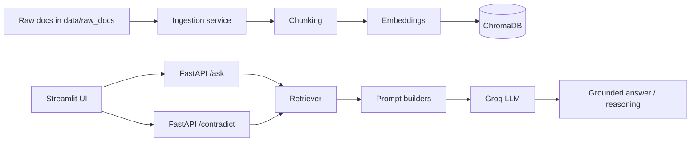

# PolicyLens

PolicyLens is a multilingual, retrieval-augmented policy assistant built for internship submission. It supports grounded question answering with citations and contradiction checking across policy documents in English, Hindi, and Marathi.

## 1. Project Overview

The project ingests policy documents from `data/raw_docs/`, chunks and embeds them into ChromaDB, and exposes a FastAPI backend for question answering and contradiction detection. A Streamlit frontend provides a simple two-tab interface for asking questions and comparing two documents on a topic.

The system is intentionally conservative: when the documents do not provide enough support, it returns a safe fallback response rather than fabricating an answer.

## 2. Architecture / Workflow



Workflow summary:

1. Documents are placed in `data/raw_docs/`.
2. `run_ingest.py` extracts text from PDF, DOCX, and TXT files.
3. The text is chunked and embedded into a local ChromaDB store.
4. The FastAPI app serves `/ask` and `/contradict`.
5. The Streamlit UI calls those endpoints over HTTP.

## 3. Folder Structure

- `app/` FastAPI app, services, schemas, and utilities
- `data/raw_docs/` source documents for ingestion
- `ui/streamlit_app.py` Streamlit frontend
- `vectorstore/` local ChromaDB persistence
- `tests/test_api.py` API tests
- `run_ingest.py` ingestion entrypoint

## 4. Code Structure and Writing Guide

PolicyLens is organized so that each layer has one clear job:

- `app/main.py` wires the FastAPI app and registers routes.
- `app/routes/` handles API requests and responses.
- `app/services/` contains the main business logic for ingestion, retrieval, Q&A, contradiction checks, and translation.
- `app/schemas/` defines request and response models.
- `app/utils/` stores shared helpers such as chunking, prompts, citations, and language helpers.
- `ui/streamlit_app.py` provides the user interface and calls the API.

When writing new code:

1. Keep request handling in routes and processing logic in services.
2. Use schemas for validation instead of manual dictionary checks.
3. Keep shared prompt or citation logic in `app/utils/`.
4. Return grounded answers only from retrieved document evidence.
5. Preserve multilingual behavior by using the existing language detection and prompt helpers.
6. Add tests for new API behavior when possible.

## 4. Setup Instructions

1. Create and activate a Python virtual environment.
2. Install dependencies:

   ```bash
   pip install -r requirements.txt
   ```

3. Copy the environment template:

   ```bash
   copy .env.example .env
   ```

4. Set `GROQ_API_KEY` in `.env` if you want live LLM responses.
5. Place policy documents in `data/raw_docs/`.

## 5. Run Ingestion

```bash
python run_ingest.py
```

This parses supported files from `data/raw_docs/` and rebuilds the local vector store.

## 6. Run FastAPI

```bash
uvicorn app.main:app --reload
```

The API runs at `http://localhost:8000`.

## 7. Run Streamlit

```bash
streamlit run ui/streamlit_app.py
```

The UI calls the FastAPI backend at `http://localhost:8000` by default.

## 8. Deploy to Streamlit Cloud

Streamlit Cloud can host the UI, but the FastAPI backend must be deployed separately.

1. Push this repository to GitHub.
2. Deploy the FastAPI app on a platform such as Render, Railway, or Fly.io.
3. Set the backend environment variable on Streamlit Cloud:

  ```text
  POLICYLENS_API_BASE_URL=https://your-backend-url
  ```

4. If you use Render or Railway, the included `Procfile` starts the API with Uvicorn.
5. In Streamlit Cloud, choose `ui/streamlit_app.py` as the entry file.
6. Add your secrets in the Streamlit Cloud app settings if needed.
7. If you want live LLM responses, make sure the backend environment has `GROQ_API_KEY`.

Streamlit Cloud secret to add:

```text
POLICYLENS_API_BASE_URL=https://your-render-service.onrender.com
```

Example backend setup on Render:

1. Create a new Web Service from the GitHub repo.
2. Use the included `render.yaml` blueprint, or set the start command to:

  ```bash
  uvicorn app.main:app --host 0.0.0.0 --port $PORT
  ```

3. Add `GROQ_API_KEY` to the service environment variables if it is not already set by the blueprint.
4. Deploy and copy the public service URL into `POLICYLENS_API_BASE_URL` on Streamlit Cloud.

The included `.streamlit/config.toml` keeps the app styling and server settings consistent on Streamlit Cloud.

## 9. API Endpoint Docs

### `GET /health`

Response:

```json
{ "status": "ok" }
```

### `POST /ask`

Request:

```json
{ "question": "What is the leave policy?" }
```

Sample response:

```json
{
  "question": "What is the leave policy?",
  "answer": "Employees are entitled to paid leave after the probation period.",
  "language": "en",
  "citations": [
    {
      "source_file": "leave_policy.pdf",
      "page": 2,
      "chunk_id": "leave_policy::p2::chunk1",
      "snippet": "Employees are entitled to paid leave after the probation period..."
    }
  ]
}
```

### `POST /contradict`

Request:

```json
{
  "doc1_id": "policy_a",
  "doc2_id": "policy_b",
  "topic": "leave policy"
}
```

Sample response:

```json
{
  "topic": "leave policy",
  "doc1": "policy_a",
  "doc2": "policy_b",
  "conflict": true,
  "reasoning": "Document A allows 12 days while Document B allows 18 days, so the policies conflict.",
  "evidence": [
    {
      "doc": "policy_a.pdf",
      "page": 2,
      "chunk_id": "policy_a::p2::chunk1",
      "snippet": "Annual leave is limited to 12 days."
    },
    {
      "doc": "policy_b.pdf",
      "page": 3,
      "chunk_id": "policy_b::p3::chunk1",
      "snippet": "Annual leave is limited to 18 days."
    }
  ]
}
```

## 10. Chunking Strategy

Documents are normalized into text and chunked with overlap so each chunk preserves local context. The current configuration uses a chunk size of 220 words and an overlap of 40 words. This gives the retriever enough surrounding text to ground answers without making prompts too large.

## 11. Hallucination Prevention Strategy

PolicyLens reduces hallucinations by:

1. retrieving only relevant chunks from the vector store,
2. building prompts that instruct the model to use only the supplied evidence,
3. returning a safe fallback when evidence is missing,
4. keeping citations separate from the answer body,
5. preferring insufficient-evidence responses over guessed answers.

## 12. Contradiction Detection Design

The contradiction checker retrieves topic-relevant evidence separately for each document and sends only those excerpts to the LLM. The model is instructed to judge conflict, no conflict, or insufficient evidence. If either document does not surface enough evidence on the requested topic, the system returns `conflict: null` instead of forcing a guess.

## 13. Limitations

- The project depends on a local vector store and document availability.
- LLM-backed translation and reasoning require a valid Groq API key.
- Retrieval quality depends on document formatting and chunk quality.
- Very ambiguous topics may still return insufficient evidence.

## 14. Future Improvements

- Add document upload through the UI.
- Show citation highlighting in the frontend.
- Add ingestion progress reporting.
- Improve topic filtering for contradiction checks.
- Add evaluation metrics for groundedness and contradiction accuracy.
- Support more languages and document formats.

## 15. AI Use Log

Use this section to record how AI was used during development and deployment.

| Tool / Model | Task | Notes |
| --- | --- | --- |
| Copilot / GPT-5.4 mini | Core debugging and feature fixes | Improved Hindi/Marathi answer quality, contradiction detection, and API wiring. |
| Copilot / GPT-5.4 mini | Documentation cleanup | Removed duplicate README content and corrected chunking details to match the code. |
| Copilot / GPT-5.4 mini | Deployment support | Added Streamlit Cloud settings, backend deployment instructions, and Render blueprint files. |
| Copilot / GPT-5.4 mini | Submission polish | Tightened the README, added a Loom demo flow, and created the AI log itself. |

## 16. Screenshot Placeholders

Add your final screenshots here before submission.

### Home / Ask Questions


### Contradiction Checker


## 18. Loom Demo Flow

Use this order for the recording:

1. Show the deployed Streamlit app opening correctly.
2. Run a question in English, then one in Hindi or Marathi.
3. Show the citations returned by `/ask`.
4. Run `/contradict` on two document IDs and explain the reasoning.
5. Show that the app returns a clear fallback when the documents do not contain enough evidence.
6. End by showing the deployed backend URL and the Streamlit Cloud secret name.
